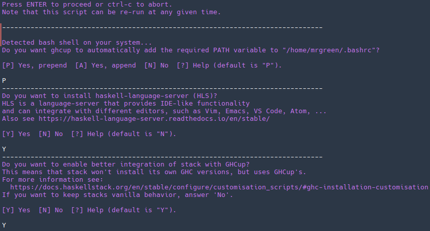

# SimpleX-Telegram bridge

## Building

### Install dependencies

In order to successfully configure bridge, following packages are needed:

> curl

Arch GNU+Linux:

```console
$ sudo pacman -S curl
```

### Prepare environment

#### Install GHCup

First step is installing GHCup. As [official site](https://www.haskell.org/ghcup/) states, run the following in a terminal (as a non-root user):

```console
$ curl --proto '=https' --tlsv1.2 -sSf https://get-ghcup.haskell.org | sh
```

Answer to script questions as follows (in case you don't understand what do questions mean):



Source environment in order to use GHCup:

```console
$ . /home/mrgreen/.ghcup/env
```

Run TUI configuration tool:

```console
$ ghcup tui
```

Install (using [i]) and set (using [s]) the following:

1. Stack 3.1.1
2. HLS 2.6.0.0
3. cabal 3.10.1.0
4. GHC 9.6.3

If you cannot see desired version, press [a] to show all versions.

### Clone into repository and build project

In order to keep your $HOME directory clean, create subdirectory for building projects, i.e. $HOME/.local/opt/ and **cd** into it.

Clone:

```console
$ git clone https://github.com/EKCKABATOP54/bridge.git
```

Change directory:

```console
$ cd bridge
```

Create necessary directory:
```console
$ mkdir -p $HOME/.simplex/bridgeData
```

Build:

```console
$ cabal run bridge
```

## Bridge set up

In order to run the bridge, run

```console
$ cabal run
```

inside repository directory (i.e. $HOME/.local/opt/bridge, if corresponding directories were created).

### Bot token

To create bot, run [BotFather](https://t.me/BotFather) in Telegram:

> /start

> /newbot

> /*desired_bot_account_name*

> /*desired_bot_account_username(short_link)*

After that [BotFather](https://t.me/BotFather) will send you message containing bot token. You can find it under "*Use this token to access the HTTP API:*" line. You'll need to send it to the bridge as an answer on the first question.

### Bot display name

Choose display name (in SimpleX) for your bot and send it to configuring bridge.

After that bot will generate address on **default** sever, i.e.:

> Bot's contact address is: simplex:/contact#/?v=2-7&smp=smp%3A%2F%2Fhpq7_4gGJiilmz5Rf-CswuU5kZGkm_zOIooSw6yALRg%3D%40smp5.simplex.im%2Fit4ORE2PqHUH0pnFMk3SHkl3O-swQ2aV%23%2F%3Fv%3D1-3%26dh%3DMCowBQYDK2VuAyEACnLVoCB8d_1o6tXafAfdb35S-700kojyscXeiYVX8E0%253D%26srv%3Djjbyvoemxysm7qxap7m5d5m35jzv5qq6gnlv7s4rsn7tdwwmuqciwpid.onion

### Further configuration

In order to proceed configuring bridge and use it later, you need to disable **any** custom server and enable at least one default on which bridge address was generated. To see, what server was used, copy bridge link and past it into SimpleX private notes. It'll look something like:

> SimpleX contact address (via smp**5**.simplex.im)

After that go into "Your SimpleX address" tab in SimpleX Chat and generate new address on default server.

Connect to the bridge using previously generated link and send your address link to it after its request.

If bridge replies with

> You are the owner now

then everything is set up.

## Usage

To use the bridge, send telegram link to person you wish to connect with. After that the person should **/start** the bot. On SimpleX side you'll receive contact connection. Accept it **using current profile** (**not incognito**). First of all, there is no point using incognito while connecting to bridge puppets since person on Telegram side won't see any of you SimpleX contact details; second, incognito puppets connection is not supported and may lead to connection loss, which is why not recommended.

After that, you should connect to each other without any problems.

Keep in mind, that right now you should use **only default servers** at all times. If not, your receiving address with a puppet may be set to custom (which bridge does not have) and lead to unfinished connection.

## What currently works

* Bridging multiple telegram chats (person <-> bridge_bot) to your SimpleX profile
* Sending and receiving text messages in both sides